I started today with a fairly simple idea:

> "I'll rent a GPU on Vast.ai, run Qwen locally, connect it to an agent harness, and use it as my coding model."

Simple, right?

It wasn't.

What started as "find a cheap GPU" turned into a rabbit hole involving model parameters, tokens, quantization, VRAM, GPU memory bandwidth, PCIe, multi-GPU inference, Ollama, Open WebUI, Docker ports, SSH tunneling, context windows, agent harnesses, and eventually a **$1.43 download bill for roughly 54.8 GB**.

But somewhere along the way, the architecture finally started making sense.

This is the step-by-step breakdown I wish I had before starting.

## 1. First: What Does a 27B Model Actually Mean?

When I saw:

```text
Qwen 3.8 27B
```

I initially thought of it as simply "a 27-billion-parameter model."

But what exactly is a parameter?

A neural network is essentially a huge collection of numerical values called **parameters**. During training, these values are adjusted so the model becomes better at predicting the next token.

A simplified mental model is:

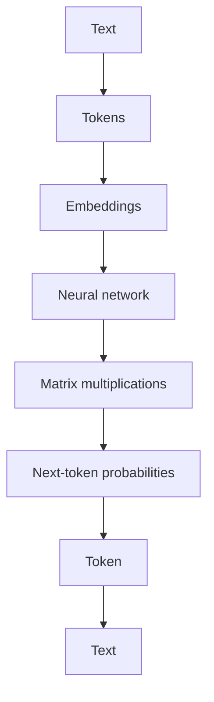

The important distinction I learned was:

> **Token ≠ weight ≠ parameter.**

A token is a representation of a piece of text.

A parameter is one of the learned numerical values inside the neural network.

So when I say a model has **27 billion parameters**, I'm talking about the learned values making up the model's weights — not 27 billion words or tokens.

That immediately explains why hardware matters.

## 2. Why Does a Model Need a GPU?

At first I wondered:

> "Why can't I just run the model using CPU + RAM?"

Technically, I can.

The problem is speed.

LLMs perform enormous numbers of mathematical operations, especially matrix multiplications. GPUs are designed to perform huge amounts of parallel numerical computation.

A simplified picture is:

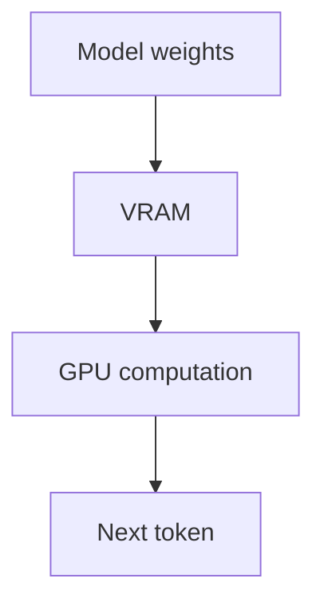

The GPU isn't just "storing the model."

It's doing the computation required to transform the current context into the next token.

That's why two GPUs with the same amount of VRAM can have very different performance.

## 3. VRAM vs GPU Memory Bandwidth

This was one of the most useful hardware distinctions I learned.

### VRAM answers:

> **Can my model fit?**

### Memory bandwidth answers:

> **How quickly can the GPU move data while computing?**

A useful analogy:

> VRAM is the size of the warehouse.  
> Memory bandwidth is how quickly trucks can move goods in and out of the warehouse.

Having a huge warehouse doesn't automatically mean goods move quickly.

For LLM inference, especially when repeatedly reading model weights, memory bandwidth can have a significant impact on generation speed.

This also explains why simply finding "the GPU with the most VRAM" isn't enough.

I need to ask:

```text
How much VRAM?
How much memory bandwidth?
How much compute?
What model?
What quantization?
What context?
```

## 4. PCIe Is Different From GPU Memory Bandwidth

Then I started seeing machines listed with:

```text
PCIe 4.0 ×16
PCIe 4.0 ×8
PCIe 3.0 ×16
PCIe 5.0 ×16
```

At first I thought:

> "Higher PCIe number = faster LLM."

Not quite.

PCIe is the connection between the GPU and the rest of the system:

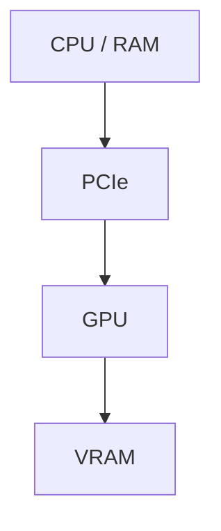

Once the model is sitting comfortably inside VRAM, most of the neural-network computation happens inside the GPU.

So for ordinary inference, GPU memory bandwidth and GPU compute can be more important than constantly moving data between CPU RAM and GPU VRAM.

PCIe becomes more important when data actually crosses that boundary — for example during model loading, CPU offloading, or some multi-GPU configurations.

This is why I stopped looking at PCIe in isolation.

A GPU with:

```text
PCIe 4.0 ×16
```

isn't automatically better for my workload than one with a different PCIe configuration.

I need to understand **what workload I'm actually running**.

## 5. Multi-GPU Changes the Equation

Once I started looking at larger models, I had another question:

> "If I need more VRAM than one GPU has, can I just use two GPUs?"

Yes — but two GPUs don't magically become one giant GPU.

For example:

```text
GPU 1 → 32 GB
GPU 2 → 32 GB
```

gives me 64 GB of total physical VRAM.

But the software has to distribute the model across them.

Now communication between GPUs matters.

The simplified picture becomes:

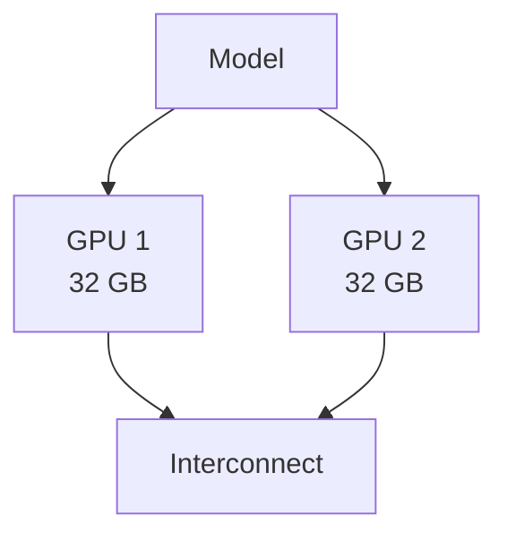

This is where technologies such as **NVLink**, when supported by the hardware, can become relevant.

So when evaluating a multi-GPU machine, I shouldn't only ask:

> "Does it have 64 or 96 GB?"

I should also ask:

- What GPU architecture?
- How much VRAM per GPU?
- What's the GPU memory bandwidth?
- How are the GPUs connected?
- What PCIe configuration does each GPU have?
- Does the inference software use the configuration efficiently?

That was a much better way of thinking about multi-GPU machines.

## 6. Quantization Changed the Hardware Requirements

Then I encountered names like:

```text
Q4_K_M
Q8_0
BF16
NVFP4
```

Initially they looked like completely different models.

They're often different **representations or quantizations of the same model**.

The basic idea is:

> Instead of storing every model parameter using high-precision numbers, we can represent the weights using fewer bits.

Conceptually:

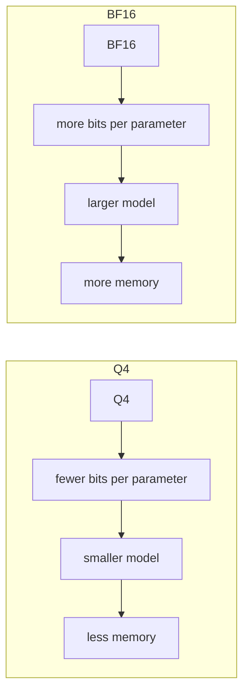

The trade-off is that lower precision can introduce some loss in numerical accuracy, although good quantization methods try to minimize the impact.

This is why a model with billions of parameters can sometimes fit into a relatively small consumer GPU.

For my NVIDIA experiments, I became particularly interested in NVIDIA-friendly quantization options while still comparing them against general GGUF/Q4 variants.

The lesson was:

> **Model parameter count alone doesn't tell me how much VRAM I need.**

I also need to know the representation of those parameters.

## 7. Choosing Between Model Variants

Ollama showed me entries such as:

```text
qwen3.8:27b
qwen3.8:27b-q4_K_M
qwen3.8:27b-q8_0
qwen3.8:27b-bf16
qwen3.8:27b-nvfp4
qwen3.8:27b-mlx
```

Even when different variants show similar metadata, their actual storage requirements and hardware compatibility can differ.

The better way to think about a model choice is:

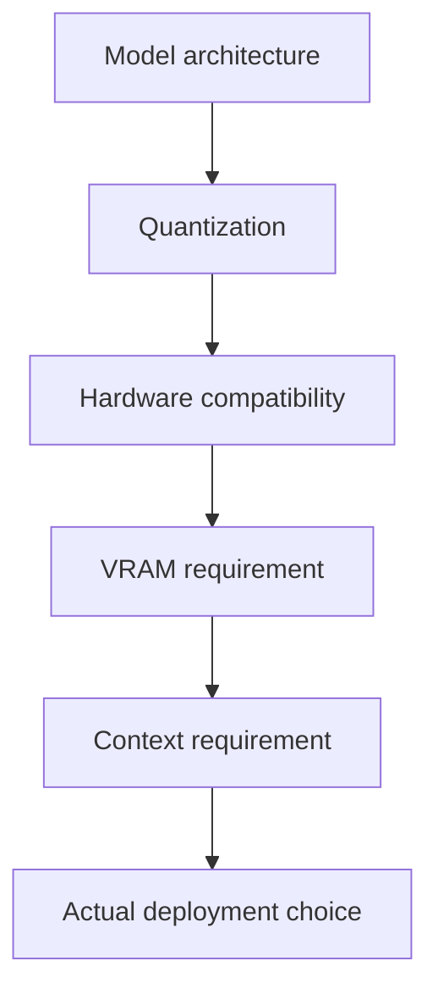

I stopped treating the model tag as just a name and started treating it as a description of a specific deployment format.

## 8. Understanding the Vast.ai Template

My first setup used a preconfigured Vast.ai template.

It included things like:

```text
Ollama
Open WebUI
Caddy
Supervisor
custom ports
startup scripts
```

That convenience was useful, but it also hid some of the infrastructure from me.

At one point I ran into a version mismatch between the Ollama client and server, and model pulls could fail when the model required a newer Ollama version.

That taught me an important lesson:

> **A template is convenient, but convenience can hide the environment you're actually running.**

For a serious setup, I want to know:

```text
Which Ollama binary?
Which server?
Which model?
Which port?
Which environment variables?
Which startup script?
Which runtime?
```

That's one reason I'd consider starting from a cleaner instance when I want maximum control.

## 9. Open WebUI, Ollama, and the Agent Are Different Layers

Another major conceptual breakthrough was separating the components.

I initially thought of Open WebUI and Ollama almost as one system.

They're not.

A better mental model is:

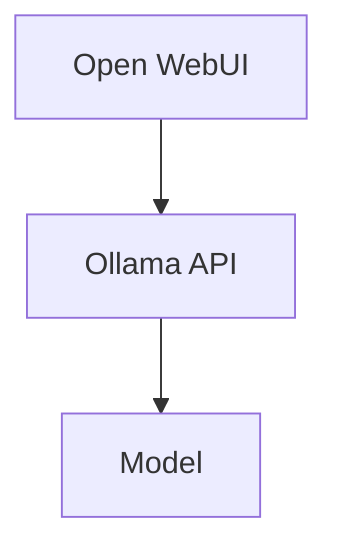

And an agent harness is another layer:

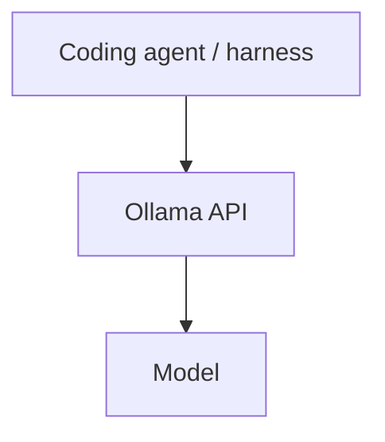

Open WebUI is the interface.

Ollama is the inference server.

The model is the model.

The agent harness is the software that allows the model to participate in a coding workflow and interact with tools/environment.

Once I understood these layers, I realized I didn't need DeepSeek Harness to go through Open WebUI.

I could keep Open WebUI open on Vast for interactive use while connecting the coding agent directly to Ollama.

## 10. Finding the Actual Ollama Endpoint

The Vast environment variables were a big clue:

```text
OLLAMA_BASE_URL=http://localhost:21434
OLLAMA_HOST=0.0.0.0:21434
OLLAMA_PORT=21434
```

So even though Ollama commonly uses port `11434`, this particular setup was configured to use:

```text
21434
```

inside the container.

I could verify it directly:

```bash
curl http://localhost:21434/api/tags
```

which returned the available models.

I also checked the running server:

```bash
ps aux | grep '[o]llama'
```

and:

```bash
curl http://localhost:21434/api/version
```

That taught me a very useful debugging principle:

> **Don't assume the application's default port. Inspect what is actually running.**

## 11. Docker Port Mapping vs the Application's Port

This was one of the most confusing networking concepts at first.

Docker port mappings look like:

```text
HOST_PORT:CONTAINER_PORT
```

But there is another layer: the application inside the container can be configured to listen on a particular port.

So there are potentially three things to distinguish:

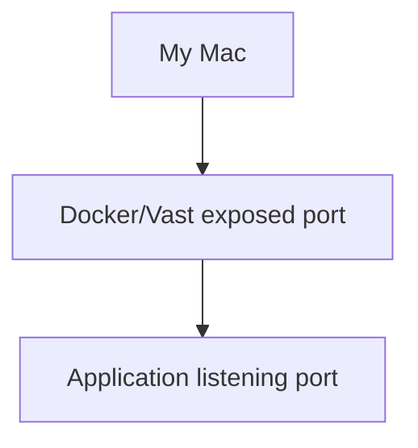

The important thing is to inspect the actual configuration instead of assuming that all three numbers must be the same.

In my case, the template had Ollama configured around port `21434`, which is why:

```bash
curl http://localhost:21434/api/tags
```

worked from inside the container.

## 12. Connecting From My Mac With SSH Tunneling

Once Ollama worked inside the Vast instance, I wanted my Mac to access it directly.

The SSH tunnel looked like:

```bash
ssh -L 11434:localhost:21434 ...
```

At first I thought:

> "Why isn't it `11434:localhost:11434`?"

Because the two sides are different.

The format is:

```text
LOCAL_PORT:REMOTE_HOST:REMOTE_PORT
```

So:

```text
11434:localhost:21434
```

means:

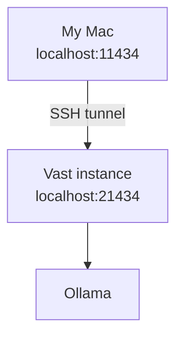

I chose `11434` on my Mac simply because it is Ollama's familiar default port.

It didn't have to be `11434`.

I could have used another local port:

```text
localhost:9999 → Vast localhost:21434
```

The left side is local.

The right side is remote.

That distinction made SSH tunneling much easier to understand.

## 13. Testing Ollama Directly

Once the tunnel was working, I could test the API directly instead of going through Open WebUI.

For example:

```bash
curl 'http://localhost:11434/api/chat' \
  -H 'Content-Type: application/json' \
  -d '{
    "model": "qwen3.8:27b",
    "messages": [
      {
        "role": "user",
        "content": "Say hello and tell me which model you are."
      }
    ],
    "stream": false
  }'
```

The request reached the Ollama server on Vast and the model responded.

I now had:

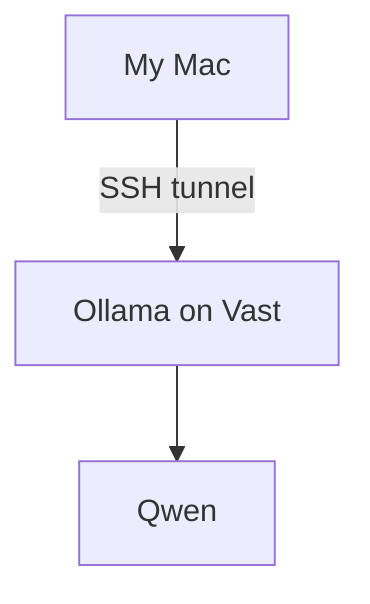

with Open WebUI remaining separate.

That was the architecture I actually wanted.

## 14. Streaming Is Still the Same API

I also learned that Ollama can return a streaming response rather than waiting for the complete response.

The important switch is:

```json
"stream": true
```

instead of:

```json
"stream": false
```

That matters for coding agents because the client can consume generated output progressively rather than waiting for the entire completion.

The networking path doesn't fundamentally change:

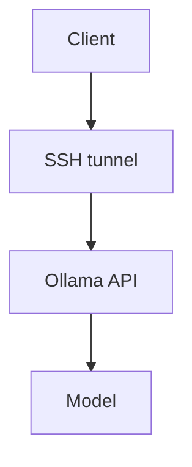

Only the response behavior changes.

## 15. Then I Hit the Context-Window Problem

This was probably the most important debugging lesson.

My model reported:

```text
context length: 262144
```

So I assumed I had a 262K context window.

Not quite.

Running:

```bash
ollama ps
```

showed:

```text
qwen3.8:27b    17 GB    100% GPU    32768
```

And the underlying process made it even clearer:

```text
llama-server ... -c 32768
```

That `-c 32768` was the actual runtime context size.

So I had:

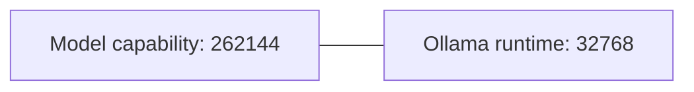

Those aren't the same thing.

This explained the error:

```text
request (33713 tokens) exceeds the available context size (32768 tokens)
```

The model wasn't necessarily incapable of handling the request.

**My runtime simply wasn't allocating a large enough context.**

## 16. Why Coding Agents Consume Context So Quickly

This became especially important once I connected Claude Code / DeepSeek Harness.

A coding agent can put a lot of information into one context:

- source files
- terminal output
- tool calls
- previous reasoning
- git diffs
- error messages
- documentation
- conversation history

So:

```text
"Model supports 256K"
```

and:

```text
"My current agent session has 256K available"
```

are two very different statements.

A repository-scale coding task can consume context surprisingly quickly.

## 17. Increasing the Runtime Context

I learned that I could explicitly configure the context length.

For example:

```bash
OLLAMA_CONTEXT_LENGTH=131072
```

corresponds to:

```text
131072 tokens = 128K
```

The common values are:

```text
32K   = 32768
64K   = 65536
128K  = 131072
256K  = 262144
```

After setting 128K, `ollama ps` showed:

```text
CONTEXT
131072
```

This was an important confirmation that I was changing the **runtime allocation**, not merely editing metadata in my agent configuration.

## 18. VRAM Is Needed for More Than Model Weights

This led to another important realization.

VRAM has to accommodate more than just the model's weights:

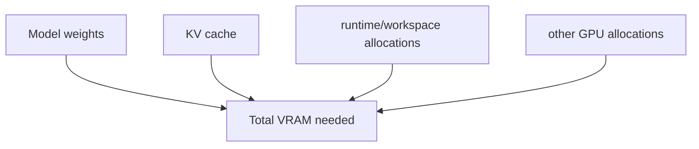

The **KV cache** is particularly important when increasing context.

A larger context means the model needs to retain more information about the current sequence, which increases memory requirements.

So the model's advertised context length is not a guarantee that every GPU can run that context comfortably.

There are really three different questions:

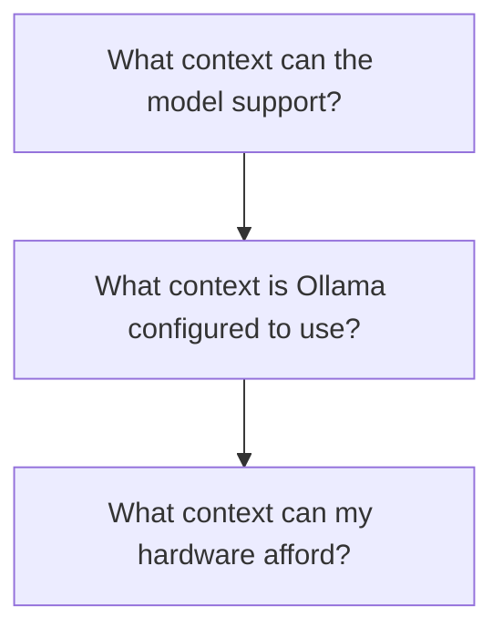

## 19. A Real 48 GB VRAM Experiment

On a machine with roughly 48 GB of GPU VRAM, I tested the 27B model.

At 128K context, I observed approximately:

```text
VRAM used:  ~27.4 GB
VRAM free:  ~21.1 GB
```

and:

```text
PROCESSOR  100% GPU
CONTEXT    131072
```

That was a useful real-world data point.

It showed that a 48 GB GPU had significant room for this particular configuration.

But I also learned not to extrapolate memory usage blindly.

You can't simply assume that doubling the context will always result in exactly double the total VRAM consumption.

The actual runtime behavior depends on the model architecture, KV-cache implementation, precision, and other runtime details.

## 20. Qwen3-Coder-Next Changed the Hardware Problem

Then I looked at **Qwen3-Coder-Next Q4_K_M**.

The model listing showed roughly:

```text
52 GB
256K context
```

That immediately changed my hardware requirements.

A single 24 GB GPU obviously isn't enough for the model.

I started comparing configurations such as:

```text
4 × 24 GB
─────────
96 GB total VRAM
```

and:

```text
2 × 48 GB
─────────
96 GB total VRAM
```

This is where all the earlier hardware concepts came together.

A 52 GB model can potentially be distributed across multiple GPUs, but total VRAM alone isn't the whole story.

I also care about:

```text
GPU memory bandwidth
GPU compute
PCIe topology
GPU-to-GPU communication
VRAM per GPU
Ollama/runtime support
price per hour
```

## 21. Comparing Multi-GPU Machines

I compared machines with configurations such as:

```text
4 × RTX 3090
```

and:

```text
2 × RTX A6000
```

and:

```text
4 × RTX A5000
```

A useful lesson was that the cheapest hourly GPU isn't automatically the best setup.

For example, a machine can have excellent PCIe bandwidth but lower GPU memory bandwidth, while another can have higher memory bandwidth but older PCIe.

There isn't one specification that determines the winner.

For my workload, I need to measure the actual model.

The process I want is:

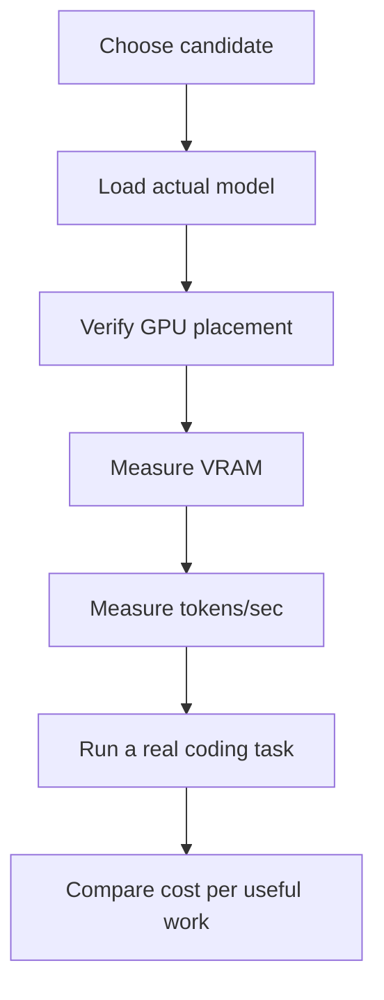

## 22. Cloud GPU Economics: The $1.43 Lesson

This was probably my favorite lesson of the day.

I rented an instance and started downloading things.

Then I checked the billing.

I saw a download charge around:

```text
$1.43
```

for roughly:

```text
54.8 GB
```

The GPU itself had barely cost me anything compared with the download.

That was when cloud GPU economics finally clicked.

The advertised GPU hourly price isn't necessarily the complete cost.

I need to think about:

```text
GPU rental
+
Storage
+
Download bandwidth
+
Upload bandwidth
```

If I repeatedly destroy instances and download a 20–50 GB model every time, bandwidth can materially change the economics.

> **The cheapest GPU isn't necessarily the cheapest setup.**

## 23. Persistent Storage Isn't Automatically Cheaper

A natural solution to repeated downloads is a persistent volume.

The idea is:

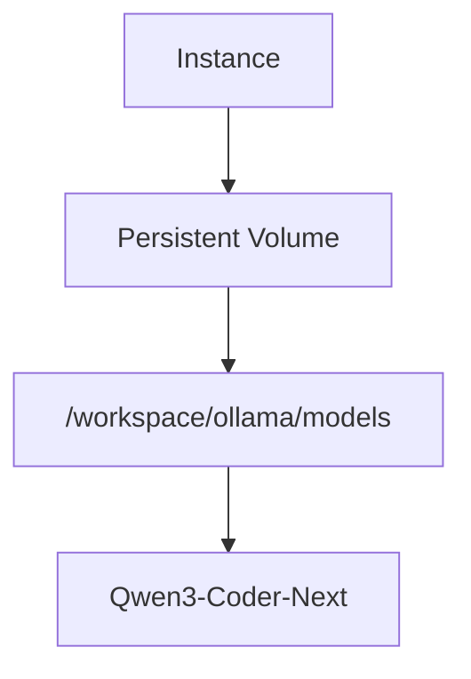

Destroy the instance:

```text
Instance ❌
Volume   ✅
```

Create another instance on the same physical host:

```text
Instance ✅
Volume   ✅
```

Mount the volume again and the model is still there.

But then I realized something important:

> **Persistent storage costs money too.**

And Vast local volumes are tied to the physical machine.

So if I create a volume on an A6000 host and later decide a 3090 host is better, I can't simply attach that same local volume to the other physical machine.

Persistent storage is therefore a **persistence and convenience mechanism**, not automatically a money-saving mechanism.

For my current experimentation, the better order is:

1. Benchmark the hardware first.
2. Pick the machine I actually want.
3. Then decide whether persistent storage is worth paying for.
4. Avoid repeatedly downloading the model if I'm going to use the same host frequently.

## 24. What My Final Architecture Looks Like

After going through all of this, the architecture I actually wanted became simple:

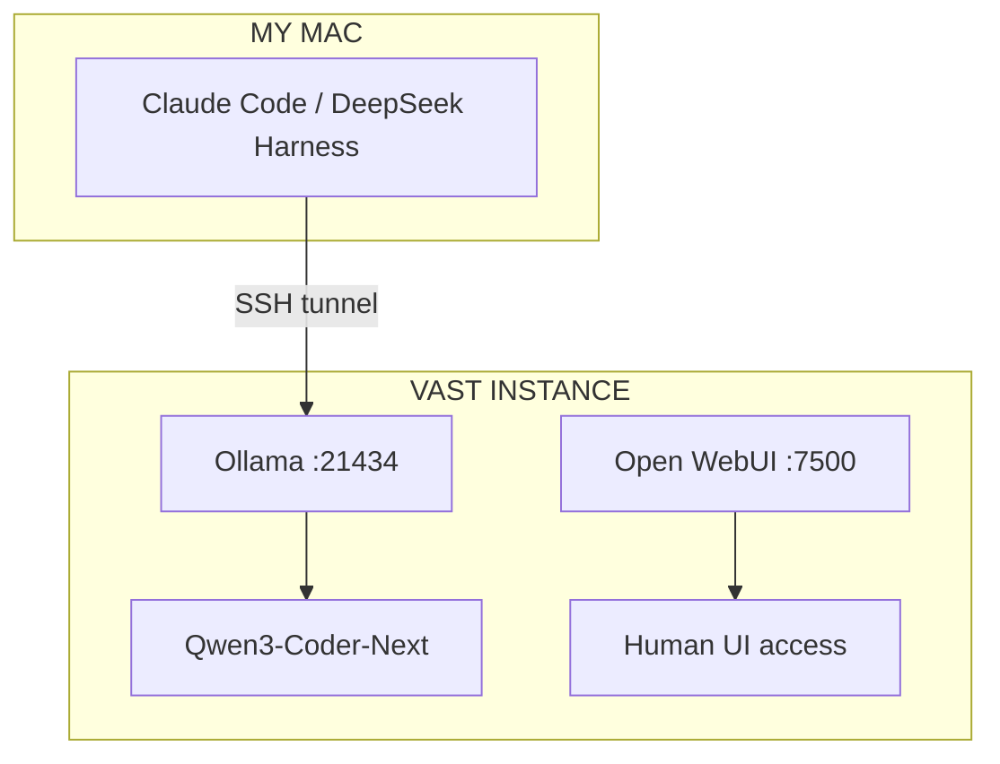

The important part is that **Open WebUI and my coding agent don't need to be in the same path**.

Open WebUI can remain available for interactive use.

DeepSeek Harness / Claude Code can connect directly to Ollama.

That separation makes the system much easier to reason about.

## 25. The Commands I Now Use to Debug the Stack

If something breaks, I don't want to randomly change configuration anymore.

I want to inspect each layer.

### Check the Ollama version

```bash
ollama --version
```

### Check the API

```bash
curl http://localhost:21434/api/version
```

### Check available models

```bash
curl http://localhost:21434/api/tags
```

### Check the model metadata

```bash
ollama show qwen3.8:27b
```

### Check what is actually loaded

```bash
ollama ps
```

### Inspect the actual Ollama server process

```bash
ps aux | grep '[o]llama'
```

This is particularly useful because the command line can expose runtime settings such as:

```text
-c 32768
```

### Check GPU memory and utilization

```bash
nvidia-smi
```

### Check memory per GPU

```bash
nvidia-smi --query-gpu=name,memory.total,memory.used,memory.free --format=csv
```

### Check multi-GPU topology

```bash
nvidia-smi topo -m
```

These commands give me a much better picture than simply looking at the web UI.

## 26. What I'd Do Differently Next Time

If I were starting again, I wouldn't immediately rent the first cheap GPU I found.

I'd first decide:

### 1. What model?

For example:

```text
Qwen3.8:27B
```

or:

```text
Qwen3-Coder-Next
```

### 2. What quantization?

I'd choose a suitable NVIDIA-compatible quantization and compare quality/performance against alternatives.

### 3. What context?

Not just:

```text
"256K sounds cool."
```

Instead:

```text
How much context does my coding workflow actually consume?
```

### 4. What GPU?

I'd compare:

```text
VRAM
GPU architecture
memory bandwidth
GPU compute
PCIe
multi-GPU interconnect
DLPerf
reliability
price
```

instead of sorting Vast by hourly price alone.

### 5. What infrastructure?

I'd prefer an environment I understand:

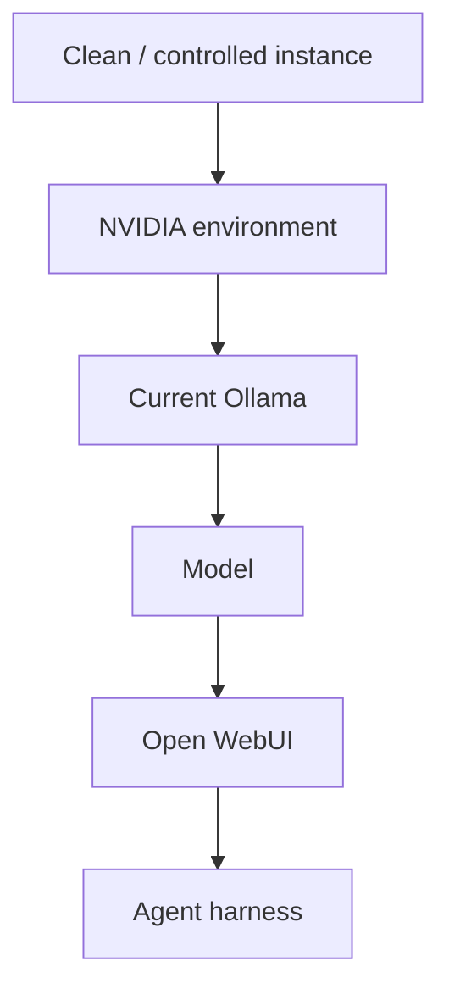

And once I choose a machine, I'd avoid unnecessary model re-downloads.

## 27. The Biggest Thing That Finally Clicked

Before today, I was thinking about this as:

> **"I need a GPU powerful enough to run Qwen."**

Now I think about it differently.

I'm actually designing a small inference system:

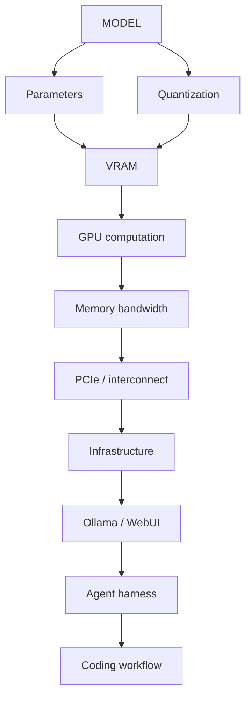

Every layer answers a different question.

**Parameters:** How large is the learned network?

**Quantization:** How compactly are its weights represented?

**VRAM:** Can the model and runtime state fit?

**Memory bandwidth:** How quickly can the GPU move data for computation?

**GPU compute:** How quickly can the mathematical operations happen?

**PCIe:** How quickly can data move between the GPU and the rest of the machine?

**GPU interconnect:** How efficiently can multiple GPUs cooperate?

**Context window:** How much input/history can the model process in one session?

**Ollama:** How do I actually serve the model?

**Open WebUI:** How do I interact with it manually?

**Agent harness:** How does the model participate in software development and tool use?

**Vast.ai:** What does the entire setup actually cost?

And that changed the way I think about the problem.

> **The biggest lesson wasn't which GPU to rent. It was learning to stop looking at the GPU as a single number and start looking at the entire inference stack.**

## What I'll Keep in Mind Next Time

- **Don't choose a GPU based only on hourly price.**
- **Model parameters, quantization, VRAM, and context are different concepts.**
- **VRAM determines whether a workload can fit; bandwidth and compute influence how fast it runs.**
- **PCIe bandwidth is not the same thing as GPU memory bandwidth.**
- **Two GPUs don't automatically behave like one giant GPU.**
- **Multi-GPU topology and interconnects matter.**
- **Quantization can dramatically change hardware requirements.**
- **A model's advertised context and the runtime's active context aren't necessarily the same.**
- **Coding agents can consume context surprisingly quickly.**
- **Cloud download costs can materially change the cost of running a model.**
- **Persistent storage costs money too, so it should be used deliberately.**
- **Templates are convenient, but understanding the underlying environment gives me much more control.**
- **Inspect the actual running processes instead of trusting assumptions.**
- **Benchmark the real workload instead of choosing hardware from specifications alone.**

And honestly, this is probably the first time I stopped thinking of an LLM as simply **"a model I can run"** and started thinking about it as **a system I have to engineer around.**
